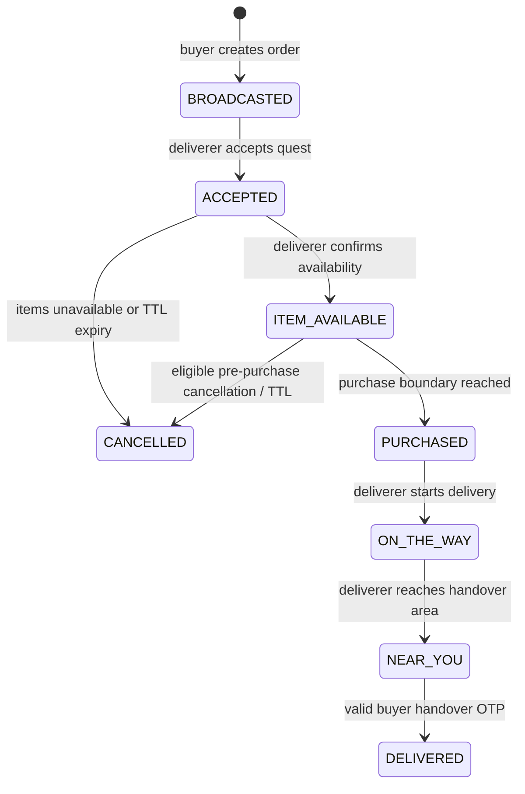

# CAmpDeliver product and operating model

This document describes the current CAmpDeliver pilot architecture and the rules the codebase is expected to enforce. It is intentionally written around the small campus pilot that exists today, while keeping the boundaries clear enough that a regulated payment provider can replace the manual money operations later.

## 1. Product purpose

CAmpDeliver is a campus-only peer-to-peer food delivery marketplace. Every normal account is a student account. The same student can place an order as a buyer and, on another order, accept a nearby delivery quest as a deliverer. There is no separate permanent deliverer account type in the operating model.

The current goal is a controlled, low-volume pilot rather than a claim of payment-gateway scale. Manual UPI verification and manual reimbursement are acceptable for that pilot as long as the app is explicit about what is and is not automated, and money-sensitive decisions remain server/admin controlled.

## 2. System boundary

| Component               | Responsibility                                                                                                            | Security boundary                                                          |
| ----------------------- | ------------------------------------------------------------------------------------------------------------------------- | -------------------------------------------------------------------------- |
| Expo Android / Expo web | Canonical student experience: auth, canteens, cart, checkout, quests, orders, earnings, tracking, chat and notifications. | Never decides prices, payment truth, authorization, or settlement truth.   |
| Next.js                 | tRPC/API host, web student surface, health endpoints and admin tools.                                                     | All privileged mutations must pass server-side authorization.              |
| Supabase Auth           | Account identity and session issuance/refresh.                                                                            | A client session is authenticated before protected tRPC work is allowed.   |
| PostgreSQL / Drizzle    | Profiles, catalog, orders, payments, settlements, chat and verification state.                                            | Database constraints and RLS are the final persistence boundary.           |
| Supabase Realtime       | Private order-scoped update signals and live deliverer-location broadcasts.                                               | Order channels are private and participant/admin authorized.               |
| Expo Push / FCM         | Best-effort Android notification delivery.                                                                                | Push is never the source of truth; opening the app must refresh API state. |

The API remains authoritative even when Expo and Next.js expose parallel student screens. UI differences must never produce different payment or order-state rules.

## 3. Actors and authority

### STUDENT

A `STUDENT` may browse active canteens, place an order, view their own orders, accept an eligible nearby quest, fulfil an assigned delivery, use order chat/contact features, and view/request their own reimbursement settlements.

A student can have at most one active buyer order and one active deliverer assignment at the same time. Those limits are enforced in both application transactions and PostgreSQL partial unique indexes. A student may still be a buyer on one order and a deliverer on a different order concurrently.

### ADMIN

An `ADMIN` is the only elevated application role. Admin-only operations include catalog/landmark management, incoming payment verification or rejection, refund recording, reimbursement settlement payout/hold actions, and finance queue visibility.

Admin authority is checked server-side. Admin role assignment must never be exposed as an ordinary student mutation.

### Unauthenticated visitor

An unauthenticated visitor may use only explicitly public catalog/auth entry points. They cannot access orders, quests, payment records, earnings, chat, contact details, private Realtime channels or admin actions.

## 4. Identity, authentication and sessions

1. Signup collects the required student/profile data and phone number.
2. Phone numbers are normalized and signup verification codes are rate limited.
3. Signup OTP material is stored as a server-side HMAC rather than plaintext when the production secret is configured.
4. Failed signup verification attempts are persisted. Five incorrect attempts produce a 15-minute server lockout.
5. Successful verification creates the Supabase identity and the application profile with role `STUDENT`.
6. Android persists the Supabase session in secure storage. Expo web uses browser storage. Next.js uses its browser/cookie integration.
7. The shared Expo session provider restores sessions, avoids clearing a still-valid session on transient failures, and pauses/resumes token refresh with app lifecycle state.
8. Explicit sign-out clears the session and unregisters the current push token.

Production requires a server-only `PHONE_OTP_HASH_SECRET`. Secrets are never shipped in Expo client configuration.

## 5. Student surfaces

### Expo Android / Expo web

| Area                 | Primary route                               | Purpose                                                                 |
| -------------------- | ------------------------------------------- | ----------------------------------------------------------------------- |
| Auth                 | `/auth`                                     | Sign up and sign in to the same student account.                        |
| Home / canteens      | `(tabs)/index`, `/canteen/[id]`             | Browse active canteens and menu items.                                  |
| Checkout             | `/checkout`                                 | Lock a delivery point and broadcast a server-priced order.              |
| Quests               | `(tabs)/quests`                             | Discover nearby broadcast orders and accept one as a deliverer.         |
| Orders               | `(tabs)/history_tab`, `/orders/[id]/status` | Current/history view and state-specific buyer/deliverer actions.        |
| Tracking             | `/order/[id]/tracker`                       | Fixed destination, route and live deliverer location.                   |
| Chat                 | `/order/[id]/chat`                          | Participant-only order chat/contact flow.                               |
| Earnings             | `(tabs)/earnings`                           | Delivery earnings, food reimbursements and settlement requests/history. |
| Admin payment screen | `/admin/payments`                           | ADMIN-only finance queue on supported surfaces.                         |

There is no user-facing wallet or top-up screen. Legacy wallet columns/table remain only for safe database rollback and are not read or written by the application.

### Next.js

Next.js maintains equivalent student order/payment pages plus the canonical web admin tools. The server-side API rules are shared, so web and Expo clients cannot bypass the same transitions.

## 6. Order lifecycle

### Current state machine

`FAILED`, `PREPARING` and `COMPLETED` exist only for legacy/rollout compatibility. New payment-model orders use the states above.

### Order creation

The client submits menu-item IDs and quantities, not trusted prices. The API reads current menu items from PostgreSQL, validates canteen ownership/availability, snapshots item names/prices, and calculates the food total server-side.

Default pilot fees are configurable environment values:

- delivery fee: 500 paise (₹5)
- platform fee: 300 paise (₹3)

The order stores the fee snapshot used for that order. Historical legacy orders are migrated with a ₹0 platform fee so their old totals are not rewritten.

### Quest acceptance

A deliverer accepts a `BROADCASTED` order through an atomic transaction. Self-acceptance is rejected. The accept path participates in the same per-order locking discipline as expiry/state mutation logic so an order cannot be simultaneously claimed and expired.

At acceptance, the deliverer explicitly chooses whether that order offers Pay at Delivery. Advance payment remains available by default. If the deliverer does not opt in, the buyer can use only the advance flow.

### Availability and purchase boundary

After acceptance, the deliverer confirms whether the requested items are available. `ITEM_AVAILABLE` is the stage where the buyer chooses the payment method.

For advance payment, the deliverer cannot confirm the canteen purchase until CAmpDeliver has verified the buyer's incoming payment.

For Pay at Delivery, the deliverer knowingly fronts the canteen cost and can confirm purchase without an incoming buyer payment because they explicitly accepted that risk for the order.

Once `PURCHASED` is recorded, normal buyer/deliverer cancellation is disabled. The order must be fulfilled or handled through an admin/support resolution path.

## 7. Pilot payment model

### Payment methods

`ADVANCE` and `PAY_AT_DELIVERY` are the only current payment methods.

#### Advance

1. Deliverer accepts the quest and confirms item availability.
2. Buyer selects Pay Now / Advance.
3. The app shows the configured CAmpDeliver UPI ID, exact server-calculated amount and order reference.
4. Buyer pays that UPI account and submits the transaction reference/UTR.
5. The payment becomes `PENDING_VERIFICATION`.
6. ADMIN compares the submitted reference against the real bank/UPI credit and either verifies or rejects it.
7. Only ADMIN verification changes the payment to `PAID`.
8. The deliverer may then spend their own money at the canteen and mark the order `PURCHASED`.

A UPI-app success screen or client-submitted UTR is never treated as proof of payment.

#### Pay at Delivery

1. Deliverer opts into Pay at Delivery when accepting the quest.
2. Buyer selects Pay at Delivery after item availability is confirmed.
3. Deliverer purchases the food using their own funds and completes the route.
4. At handover, the buyer pays digitally to the configured CAmpDeliver UPI account.
5. Buyer submits the transaction reference.
6. ADMIN verifies the actual bank/UPI credit.
7. The handover OTP remains hidden until the order is `NEAR_YOU` and payment is `PAID`.
8. Buyer shares the OTP only after receiving the order.

This is not payment-provider escrow. It is an owner-operated manual trust layer suitable only for the controlled pilot. A scaled/commercial deployment should replace it with a compliant payment/marketplace settlement provider without changing the order state machine.

### Payment states

`NOT_STARTED -> AWAITING_SELECTION -> AWAITING_PAYMENT -> PENDING_VERIFICATION -> PAID`

A bad/admin-rejected reference becomes `REJECTED` and can be resubmitted while the order is still eligible. A verified payment on an order cancelled before purchase becomes `REFUND_REQUIRED`, then `REFUNDED` after ADMIN records the outgoing refund reference.

### Reimbursement and earnings

Successful handover creates exactly one settlement record for the deliverer:

- `foodReimbursement = foodPrice`
- `deliveryEarning = deliveryFee`
- `amountDue = foodPrice + deliveryFee`
- initial status = `AVAILABLE`

The platform fee is retained by CAmpDeliver and is not part of the deliverer's reimbursement.

The deliverer explicitly requests reimbursement from Earnings. `AVAILABLE` becomes `PENDING` and appears in the ADMIN settlement queue. ADMIN can place it `ON_HOLD` with a reason, mark operational failure as `FAILED`, or record the outgoing transfer reference and mark it `PAID`.

The Earnings dashboard separates delivery earnings from food reimbursement and shows lifetime/paid/pending settlement totals. It does not present a spendable wallet balance.

## 8. Cancellation and TTL rules

### Buyer cancellation

The buyer can cancel only while the order is still `BROADCASTED`. After another student accepts the quest, buyer cancellation is disabled.

### Deliverer cancellation

- `ACCEPTED`: deliverer may end the quest only as `ITEMS_UNAVAILABLE`.
- `ITEM_AVAILABLE` with unpaid/unverified money: no normal manual cancellation; TTL/backend expiry handles ghosted flows.
- `ITEM_AVAILABLE` with verified advance payment: deliverer may cancel before purchase; the buyer payment is preserved for reconciliation and becomes `REFUND_REQUIRED`.
- `PURCHASED` or later: normal deliverer cancellation is disabled.

### Backend TTL defaults

| State/phase                                   | Default TTL |
| --------------------------------------------- | ----------: |
| Broadcast waiting for acceptance              |  10 minutes |
| Accepted waiting for availability             |   5 minutes |
| Buyer payment-method selection                |   5 minutes |
| Submitted payment waiting for verification    |  15 minutes |
| Verified advance payment waiting for purchase |  10 minutes |

The values are configurable. The expiry worker uses server timestamps and per-order transaction locks. Purchased/on-route orders never auto-cancel.

A backend scheduler should call `/api/cron/orders` with `Authorization: Bearer <CRON_SECRET>` so expired orders are handled even when no student has the app open.

## 9. Handover OTP

The buyer's four-digit handover OTP is not a payment credential. It proves physical handover after money requirements are satisfied.

The OTP is visible to the buyer only when the order is `NEAR_YOU` and the payment is `PAID`. Only the assigned deliverer may submit it. Five incorrect attempts trigger a 15-minute server-side lock. Attempts are serialized under an order transaction lock, so concurrent requests cannot bypass the counter.

Successful verification is idempotent: a repeated completion call for an already delivered order cannot create a second settlement.

## 10. Location, chat and contact privacy

Checkout stores one fixed delivery coordinate. The deliverer cannot change the buyer's destination.

Quest discovery returns only the minimum pre-accept information needed to decide whether to take a delivery. Exact drop-off coordinates and participant-specific data are not exposed to unrelated nearby students.

Only the assigned deliverer can publish live `location_update` events. Private `order:<uuid>` Supabase Realtime channels are limited to the order buyer, assigned deliverer or ADMIN. Realtime RLS permits only the app's known order/chat/location events. Supabase Realtime public-channel access should be disabled during rollout.

Chat messages are limited to order participants, message input is trimmed/length-bounded, and order IDs are UUID-validated. Contact phone access is limited to the active shared delivery relationship rather than permanently exposing a historical counterparty's number.

Android requests foreground location only; background-location permission is not required by the current app.

## 11. Push notifications

Push notifications are advisory. Important current events include quest availability, order-state changes, payment-verification activity, settlement requests/holds and completion.

The Expo client re-registers its token on foreground and listens for token rotation. The API understands Expo ticket failures and does not log a rejected provider ticket as success. FCM V1 credentials remain an EAS/Expo operational prerequisite.

## 12. Admin operations

The ADMIN finance page provides three manual operational queues:

1. Incoming payment verification/rejection.
2. Buyer refunds required after a verified pre-purchase payment is cancelled.
3. Deliverer reimbursement settlements requested from Earnings.

Admin actions record the acting admin and transfer/reference data where applicable. A settlement can be put on hold with a reason and later paid.

Catalog administration covers canteens, menu availability and landmarks. Money/admin state must remain server-authorized even if the UI is modified.

## 13. Database security model

The payment/security migration is intentionally explicit because it changes live privileges and data constraints.

It provides:

- payment and settlement tables with one-record-per-order uniqueness;
- nonnegative/valid money and coordinate constraints;
- one-active-buyer-order and one-active-deliverer-assignment partial unique indexes;
- updated-at triggers and state/role constraints;
- RLS on sensitive profile/order/payment/settlement/chat/OTP/legacy-wallet tables;
- least-privilege grants that prevent authenticated clients from directly mutating backend-owned financial/order tables;
- private Realtime authorization for order channels;
- persisted OTP failure/lockout state.

The API/service role remains the mutation path for protected business operations. RLS is a second boundary, not a replacement for tRPC authorization.

The migration refuses to apply while legacy active orders exist. `security:preflight` reports active-order/status counts, legacy deliverer roles and payment-schema presence without changing data. `security:check` then executes the migration inside a transaction and rolls it back, allowing production compatibility to be tested before privileges change.

## 14. Staged deployment compatibility

A payment-aware APK must not break merely because the database migration has not been deployed yet.

The backend therefore exposes payment-schema readiness and supports a read-only compatibility state:

- legacy order history remains readable;
- Earnings/Admin show a clear `Payment upgrade pending` state;
- Quests, Checkout and new payment/delivery mutations are paused;
- background tracking/private Realtime are not started against an incompatible schema;
- legacy participant chat can continue using polling;
- `/api/health/payment-schema` returns readiness for deployment checks.

This compatibility mode is only a rollout safety mechanism. It does not activate the new payment flow. The new flow is active only after the migration/RLS rollout and required production configuration is complete. The receiving UPI destination is managed dynamically by an ADMIN in the app rather than through deployment environment variables.

## 15. Production/pilot configuration

ADMIN-managed payment configuration includes the receiving UPI ID and payee name in **Payments & Settlements**. Each change is stored with an audit record and takes effect for new buyer payment selections without a redeploy. The selected destination is then snapshotted onto that order's payment record, so changing the platform UPI does not reroute an in-progress payment or make later bank reconciliation ambiguous.

Backend-only or deployment configuration includes:

- `DELIVERY_FEE_PAISE`
- `PLATFORM_FEE_PAISE`
- `ORDER_BROADCAST_TTL_SECONDS`
- `ORDER_ACCEPTED_TTL_SECONDS`
- `ORDER_PAYMENT_SELECTION_TTL_SECONDS`
- `ORDER_PAYMENT_VERIFICATION_TTL_SECONDS`
- `ORDER_PAID_PURCHASE_TTL_SECONDS`
- `PHONE_OTP_HASH_SECRET`
- `CRON_SECRET`

No bank credential, private key or server secret belongs in Expo public environment variables.

## 16. Definition of done for a pilot order

A successful payment-model order is complete only when:

- the buyer session is authenticated;
- menu items and prices were validated server-side;
- the delivery point was fixed;
- another eligible student atomically accepted the quest;
- item availability was confirmed;
- the selected payment method followed its required verification boundary;
- canteen purchase occurred only when the payment policy allowed it;
- location/chat access remained participant scoped;
- buyer payment was verified before OTP handover;
- the handover OTP succeeded exactly once;
- exactly one reimbursement settlement was created;
- the deliverer requested reimbursement when desired;
- ADMIN recorded the outgoing settlement payment;
- any pre-purchase cancellation with verified incoming money entered the refund queue instead of losing accounting state.

## 17. Scaling path

The pilot deliberately keeps payment operations manual. If usage grows, the first major replacement should be the money adapter rather than the fulfilment state machine: provider-created payment intents, signed webhooks, idempotent reconciliation, marketplace/split settlement or payouts, automated refunds and auditable provider references.

Additional scale work should include multi-device push-token storage, session/device management, account recovery, dispute/support tooling, immutable admin/action audit logs, operational analytics, load testing and a formal privacy/retention policy.

The project should describe the current manual system accurately rather than claiming those provider/compliance features exist before they are funded and implemented.
