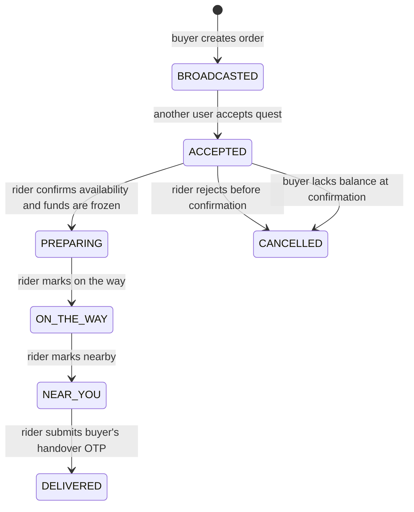

# CAmpDeliver product and operating model

**Status:** working product specification and implementation map  
**Last reviewed:** 2026-09-08  
**Audience:** product owners, engineers, campus operations, and administrators

## 1. Purpose and reading guide

CAmpDeliver is a campus-only, peer-to-peer food delivery marketplace. A student can order food from a participating canteen (**buyer**) or accept a nearby delivery request (**deliverer/rider**). The system holds the buyer's funds while the delivery is in progress, then records the campus/admin share and deliverer payout when handover is verified.

This document separates three things deliberately:

- **Implemented** — behavior backed by the current codebase.
- **Operational rule** — a decision that staff must follow even when it is not yet enforced in code.
- **Proposed** — the recommended production rule or implementation work that closes a known gap.

The labels matter. A screen or enum value does not make a workflow safe by itself; the API authorization, state transitions, money movement, notification delivery, and operational policy must agree.

## 2. Product boundary and system map

```text
                         ┌─────────────────────────────────┐
                         │ Supabase                          │
                         │ Auth · PostgreSQL · Realtime      │
                         └───────────────┬─────────────────┘
                                         │
 ┌─────────────────────┐  tRPC/HTTPS    ▼      Push API      ┌───────────────┐
 │ Expo universal app  ├────────────► Next.js API ───────────► Expo / FCM     │
 │ Android + Expo web  │               business rules         │ Android device│
 └─────────┬───────────┘                                      └───────────────┘
           │
           │ same API and database
           ▼
 ┌─────────────────────┐
 │ Next.js web          │
 │ administration       │
 │ plus older user UI   │
 └─────────────────────┘
```

### Current deployment responsibilities

| Layer                | Current responsibility                                                                                                                              | Important restriction                                                                                                                                               |
| -------------------- | --------------------------------------------------------------------------------------------------------------------------------------------------- | ------------------------------------------------------------------------------------------------------------------------------------------------------------------- |
| Expo app             | Canonical buyer and deliverer experience for Android and Expo web: canteens, cart, checkout, quests, orders, wallet, tracking, chat, notifications. | Native notification and secure-storage behavior requires a built Android build; Expo Go on Android cannot receive remote push notifications with current Expo SDKs. |
| Next.js              | tRPC API gateway, server-side authorization, and web-first admin tools. It also contains older/parallel buyer and deliverer web pages.              | It must be the only place that performs money, role, and order-state mutations. The client must never be trusted for these decisions.                               |
| Supabase Auth        | Password-based auth using a phone-derived virtual email (`<E.164 phone>@campus.edu`), plus session issuance/refresh.                                | Supabase is the identity authority; the app database profile is an application record, not proof of identity.                                                       |
| PostgreSQL / Drizzle | Profiles, canteens, menus, landmarks, orders, wallet ledger, messages, OTP verifications, and push token.                                           | Money and order transitions need database transactions and immutable audit records.                                                                                 |
| Supabase Realtime    | Live location and chat invalidation/update signaling.                                                                                               | Realtime complements the API; it does not replace authorization checks.                                                                                             |
| Expo Push / FCM      | Delivers notification payloads to Android devices.                                                                                                  | Requires a valid Expo token on the user record and FCM V1 credentials configured in EAS. Push delivery is best effort, never the source of truth.                   |

### Product-source-of-truth rule — proposed

The Expo app should remain the only canonical buyer/deliverer UI on Android and web. The parallel Next.js user pages should either be redirected to the Expo web client or explicitly maintained as an equal product surface. Keeping two independently evolving buyer/deliverer UIs creates inconsistent session, payment, and status behavior.

The Next.js site should remain the canonical **admin web console** and API host.

## 3. Actors, roles, and authority

### Current roles

| Role in profile         | What the current system permits                                                                                                                                                                   | Current limitation                                                                                                                            |
| ----------------------- | ------------------------------------------------------------------------------------------------------------------------------------------------------------------------------------------------- | --------------------------------------------------------------------------------------------------------------------------------------------- |
| `STUDENT`               | Sign up, sign in, browse canteens, create an order, top up wallet, view own orders, chat, and retrieve another party's phone number for a shared order. A signed-in user can also accept a quest. | The API does not currently require `role = DELIVERER` to accept and fulfil a quest. In practice, a student can be both buyer and deliverer.   |
| `DELIVERER`             | Exists in the database type but is not an enforced operational gate.                                                                                                                              | No rider onboarding, approval, availability, compliance, or payout eligibility workflow exists.                                               |
| `ADMIN`                 | Server-side `adminProcedure` checks the profile role before allowing canteen, menu, and landmark management.                                                                                      | There is no dedicated audit log, operations dashboard, refund console, user moderation workflow, or controlled admin-role assignment process. |
| Unauthenticated visitor | Can see public active-canteen, menu, and landmark data and request an account OTP.                                                                                                                | Cannot use wallet, orders, quests, chat, contact details, or admin actions.                                                                   |

### Target authority model — proposed

| Capability                          |           Buyer |  Approved deliverer |                       Admin | Notes                                            |
| ----------------------------------- | --------------: | ------------------: | --------------------------: | ------------------------------------------------ |
| Browse canteens/menu                |             Yes |                 Yes |                         Yes | Guests may browse public catalog if desired.     |
| Create / cancel own order           |             Yes |                  No |            Support override | Buyer cancellation must be state-dependent.      |
| See / accept nearby quest           |              No |                 Yes |            Support override | Acceptance must atomically claim the order.      |
| Update delivery progress / location |              No | Assigned rider only |            Support override | Require assignment and an allowed state.         |
| View chat/contact                   |  Own order only | Assigned order only |   Controlled support access | Never disclose a phone number before assignment. |
| Wallet top-up / payment history     | Own wallet only |     Own wallet only |       Reconciliation access | Balance is never client-authoritative.           |
| Canteen/menu/landmark management    |              No |                  No |                         Yes | Every change should be audit logged.             |
| Refund, dispute, user suspension    |    Request only |        Request only | Authorized operations staff | Requires explicit policy and tools.              |

**Proposed policy:** retain `STUDENT` as the base identity role. Add a separate deliverer eligibility/availability record rather than treating `DELIVERER` as a permanent, unverified role. A student becomes eligible only after campus verification and policy acceptance; availability is active only while they opt in.

## 4. Identity, authentication, and sessions

### Implemented account lifecycle

1. A person supplies name, hostel, phone number, and password.
2. The API normalizes the phone number to E.164, creates a six-digit verification record that expires in five minutes, and limits requests to three per 15 minutes per number.
3. The user supplies the verification code. The API creates the Supabase account and an application profile with role `STUDENT`.
4. The mobile client stores the resulting Supabase session and routes into the authenticated app. Existing users sign in with the phone-derived virtual email and password.
5. Protected API calls authenticate with an Android/web bearer token or a Next.js Supabase cookie. `adminProcedure` then reads the application profile and requires `ADMIN`.

### Session behavior by surface

| Surface                   | Session storage and restoration                                                                                                                         | Expected user experience                                                                                                                                                               |
| ------------------------- | ------------------------------------------------------------------------------------------------------------------------------------------------------- | -------------------------------------------------------------------------------------------------------------------------------------------------------------------------------------- |
| Android                   | Supabase session is stored in Expo SecureStore. The shared `AuthSessionProvider` restores it once on launch and refreshes only while the app is active. | Swiping the app out of Recent Apps and reopening must retain login, provided the token remains valid and the user did not sign out or uninstall. Uninstall clears Android SecureStore. |
| Expo web                  | The Expo web adapter uses browser `localStorage`; a memory fallback is used only where browser storage is unavailable.                                  | Closing/reopening the browser keeps the session until sign-out, storage clearing, token invalidation, or browser policy prevents storage.                                              |
| Next.js web               | Browser Supabase client plus server-side Supabase cookies.                                                                                              | A browser session is restored through cookies/local client state. This is a separate UI integration from Expo web.                                                                     |
| Background / inactive app | Token refresh is stopped while Android is inactive and resumed when active. Remote notification delivery remains a native FCM responsibility.           | The app need not run for a visible push notification to arrive. A notification tap can cold-launch the app and route to the linked screen.                                             |

### Session rules

- **Implemented:** explicit sign-out clears the local Supabase session and unregisters the currently stored push token from the user's profile.
- **Implemented:** an expired or invalid access token results in the normal Supabase unauthenticated flow; protected API calls return `UNAUTHORIZED`.
- **Operational rule:** a user must be able to revoke all sessions from account settings or support. This is **not implemented**.
- **Proposed:** use a `device_sessions` table for device name, last active time, revoke status, and push-token relationship. One `profiles.pushToken` field only supports a single active device reliably.
- **Proposed:** add password reset, account deletion, and support-assisted recovery. Do not silently recreate a different account for an already registered phone number.

### Authentication security gaps — proposed work

1. Store only a salted password through Supabase Auth (already delegated to Supabase); never add app-level password storage.
2. Move OTP generation to a cryptographically secure source and store a one-way verification hash rather than a plaintext code.
3. Do not log live OTP codes in production. Logging is acceptable only behind a development/test guard with access-controlled logs.
4. Add rate limits by IP/device in addition to phone number, bot protection, and a support process for recycled phone numbers.
5. Require current-password or OTP confirmation for password, phone, or payout-account changes.

## 5. User surfaces and pages

### Canonical buyer/deliverer app: Expo Android and Expo web

| Area                   | Primary pages                                                            | Buyer behavior                                                                                                                   | Deliverer behavior                                                                                            |
| ---------------------- | ------------------------------------------------------------------------ | -------------------------------------------------------------------------------------------------------------------------------- | ------------------------------------------------------------------------------------------------------------- |
| Auth                   | `/auth`                                                                  | Sign up with phone OTP or sign in.                                                                                               | Same account entry point; no separate rider sign-in currently.                                                |
| Home/canteens          | `(tabs)/index`, `/canteen/[id]`                                          | Browse active canteens, menus, and add one canteen's items to local cart.                                                        | May browse but normally uses Quests.                                                                          |
| Cart/checkout          | `/checkout`                                                              | Grants foreground location only when placing an order; resolves a drop-off label from current location/landmarks; creates order. | Not relevant to order fulfilment.                                                                             |
| Quests                 | `(tabs)/quests`                                                          | Can see the screen but should not accept as buyer.                                                                               | Reads foreground location and shows broadcast orders inside the configured canteen radius; accepts one quest. |
| Orders/status          | `(tabs)/history_tab`, `/orders/[id]/status`                              | Views own history, status, handover OTP, map/chat links.                                                                         | Views assigned work and gets action controls appropriate to status.                                           |
| Live tracker           | `/order/[id]/tracker`                                                    | Sees fixed drop-off and deliverer progress.                                                                                      | Shares foreground location while assigned delivery is active.                                                 |
| Chat/call              | `/order/[id]/chat`                                                       | Chat/call only with the assigned rider on a shared active order.                                                                 | Chat/call only with that order's buyer.                                                                       |
| Wallet                 | `(tabs)/wallet`                                                          | Sees balance and submits a top-up reference.                                                                                     | Sees earnings/balance and submits a top-up reference.                                                         |
| Admin links            | `/admin/canteens`, `/admin/landmarks`                                    | Not available.                                                                                                                   | Not available.                                                                                                |
| Admin links on Android | Same paths render informational screens directing the user to web admin. | N/A                                                                                                                              | N/A                                                                                                           |

### Next.js web surfaces

| Area                                                                                                                            | Current purpose                                                           | Rule                                                                                                             |
| ------------------------------------------------------------------------------------------------------------------------------- | ------------------------------------------------------------------------- | ---------------------------------------------------------------------------------------------------------------- |
| `/`                                                                                                                             | Auth form and user dashboard.                                             | Treat as legacy/parallel buyer-deliverer surface until the product decision in Section 2 is made.                |
| `/canteen/[id]`, `/checkout`, `/quests`, `/orders`, `/orders/[id]/status`, `/order/[id]/tracker`, `/order/[id]/chat`, `/wallet` | Parallel web versions of marketplace and delivery features.               | Must have the same API authorization and business rules as Expo; do not let UI differences alter state handling. |
| `/admin/canteens`                                                                                                               | Admin canteen CRUD, location/radius configuration, and menu availability. | Admin-only server rule; mobile must not be used for sensitive catalog operations.                                |
| `/admin/landmarks`                                                                                                              | Admin landmark/hostel/academic-block CRUD and radius configuration.       | Admin-only server rule; changes affect checkout labels and quest geography.                                      |

## 6. Order lifecycle and delivery workflow

### Current order state machine



`COMPLETED` exists in the data type but is not set by the current workflow. Treat `DELIVERED` as the terminal success state until the state model is corrected.

### Buyer workflow — implemented

1. Buyer signs in, opens an active canteen, and adds available menu items to the local cart. The cart is limited to one canteen at a time.
2. At checkout, the buyer permits foreground location. The app records a fixed delivery coordinate and a landmark/current-location label with the order. The delivery location must not change afterward.
3. `createOrder` calculates food price from the client-supplied item prices and quantity, adds the fixed ₹5 delivery fee, and creates `BROADCASTED` order data.
4. Registered devices receive a best-effort quest push; nearby quest screens discover the order by geospatial filtering.
5. After acceptance and availability confirmation, the buyer's wallet funds are moved to `frozenBalance`; the buyer receives a four-digit handover OTP and tracks/maps/chats with the rider.
6. Buyer gives the OTP only after receiving the food. Successful rider verification sets delivery complete and triggers ledger entries/pushes.

### Deliverer workflow — implemented

1. A signed-in user grants foreground location and opens Quests.
2. The client asks `availableQuests` for broadcast orders close to current location and sees the promised delivery fee.
3. The user accepts an eligible `BROADCASTED` order. The server rejects self-acceptance and orders no longer in broadcast state.
4. In `ACCEPTED`, the rider confirms item availability. The server verifies buyer balance, freezes the full buyer amount, creates a handover OTP, and changes state to `PREPARING`.
5. Rider marks `ON_THE_WAY`, then `NEAR_YOU`, while location tracking publishes coordinates for the live tracker.
6. Rider obtains the buyer's four-digit code, enters it, and completes the delivery. The current ledger credits the rider with food price plus ₹2.25 and credits the first admin profile with ₹2.75.

### Workflow invariants

| Invariant                                                  | Current position                                                                                           | Required/target rule                                                                                                                               |
| ---------------------------------------------------------- | ---------------------------------------------------------------------------------------------------------- | -------------------------------------------------------------------------------------------------------------------------------------------------- |
| A buyer cannot accept own order.                           | Enforced.                                                                                                  | Keep.                                                                                                                                              |
| Only one rider can claim a quest.                          | Partially enforced by checking `BROADCASTED`, but claim is not an atomic conditional update.               | Use `UPDATE ... WHERE status = 'BROADCASTED' AND deliverer_id IS NULL RETURNING` in a transaction; handle zero rows as already claimed.            |
| Funds are not frozen before a rider confirms availability. | Enforced.                                                                                                  | Keep.                                                                                                                                              |
| The order price is authoritative.                          | **Not enforced:** order creation totals client-submitted item price.                                       | Read current menu prices server-side, validate every item belongs to the selected canteen and is available, then snapshot server-calculated price. |
| Only assigned rider updates progress/location.             | Enforced for most rider actions.                                                                           | Keep and add an explicit verified deliverer eligibility check.                                                                                     |
| Progress changes follow order.                             | **Not fully enforced:** status input is loosely parsed and OTP completion is not restricted to `NEAR_YOU`. | Enforce a strict transition table server-side. For example, `PREPARING → ON_THE_WAY → NEAR_YOU → DELIVERED`; reject skips and repeats.             |
| Handover code cannot be guessed indefinitely.              | Four digits; no attempt tracking.                                                                          | Hash OTP, expiry, maximum failed attempts, and require `NEAR_YOU`; require support escalation after lockout.                                       |
| Cancellation returns money correctly.                      | Partial: a pre-freeze rejection cancels; buyer cancellation/refund policy is absent.                       | Define and implement cancellation/refund transitions with idempotent ledger entries.                                                               |

### Target state machine — proposed

```text
DRAFT (client only)
  → BROADCASTED
  → CLAIMED                  (rider has reserved it; short timer)
  → PREPARING                (payment authorization/freeze succeeds)
  → PICKED_UP                (optional explicit event)
  → ON_THE_WAY
  → NEAR_YOU
  → DELIVERED_PENDING_CONFIRMATION
  → COMPLETED

Any pre-completion state → CANCELLED / REFUND_PENDING / REFUNDED
```

**Proposed operational choices:**

- `CLAIMED` expires (for example, 3 minutes) if the rider does not confirm availability; then the order is rebroadcast.
- Buyer cancellation is free before `CLAIMED`; after claim it follows a clearly displayed cancellation policy.
- A rider cannot mark `PICKED_UP` or `ON_THE_WAY` until payment has been successfully frozen.
- `COMPLETED` means financial settlement is final; `DELIVERED` can mean physical handover recorded but subject to a short buyer dispute window if that model is wanted.
- Every state transition records actor, time, old/new status, reason code, and optional support/admin actor.

## 7. Money, wallet, and payment platform

### Current ledger behavior

| Event                       | Current database effect                                                                                                                                            |
| --------------------------- | ------------------------------------------------------------------------------------------------------------------------------------------------------------------ |
| Wallet top-up               | User enters an amount and UTR-like reference. The API immediately credits the requested amount and records `TOP_UP / SUCCESS` if the reference is unique.          |
| Rider confirms availability | Checks buyer available balance; deducts `foodPrice + deliveryFee` from `walletBalance`, adds it to `frozenBalance`, and records `ORDER_FREEZE / SUCCESS`.          |
| Rider verifies handover OTP | Decreases buyer frozen balance by full total; credits first `ADMIN` profile ₹2.75 and rider `foodPrice + ₹2.25`; records `ADMIN_COMMISSION` and `DELIVERY_PAYOUT`. |
| Push/message failure        | Does not reverse the underlying money mutation.                                                                                                                    |

### Critical current restriction

**There is no live payment-gateway integration or UTR verification.** A user can submit any unique value longer than five characters and receive wallet credit. This is suitable only for a demo/test environment. It must not handle real money.

### Production payment model — proposed

Use a payment-provider adapter with UPI support (for example, Razorpay or Cashfree; final provider requires a commercial/compliance decision). The provider, not the client, confirms payment.

1. Client requests a top-up intent for a server-calculated amount.
2. API creates `wallet_top_up` with `PENDING` status and provider order/payment reference.
3. Client completes provider checkout/UPI flow.
4. Provider sends a signed webhook to the API.
5. API verifies webhook signature, idempotency key, amount, currency, and payment-success state.
6. In one transaction, API marks the top-up successful, creates a wallet `TOP_UP` ledger entry, and credits available balance.
7. Failed/expired/reversed payments do not credit balance and are recorded for support/reconciliation.

**Temporary alternative:** If manual UTR verification is required, top-ups must enter `PENDING`, a finance/admin user must attach proof and approve/reject them, and the user must not be credited automatically.

### Financial rules — proposed

- Store all money as integer paise, as current schema does. Never calculate money from JavaScript floating-point values after input conversion.
- Add immutable `wallet_entries` with debit/credit, balance-before/after, currency, actor, idempotency key, and reference type/id.
- Enforce one settlement per order with a database uniqueness constraint; retries must be idempotent.
- Make the fee schedule configurable and snapshot it on the order. Do not hard-code ₹5 / ₹2.25 / ₹2.75 inside request handlers.
- Decide who pays the canteen. The current rider payout includes the full food price, which is valid only if the rider advances/pays the canteen price. If CAmpDeliver pays canteens directly, split food settlement into a canteen payable instead.
- Implement refund reasons: no rider, rider unavailable, canteen unavailable, buyer cancellation, duplicate charge, and support adjustment.
- Reconcile provider settlements, wallet entries, payout obligations, and admin commission daily.

## 8. Location, tracking, chat, contact, and notifications

### Location and tracking

- **Implemented:** checkout requests foreground location just in time and stores a fixed drop-off coordinate.
- **Implemented:** Quests request foreground location and filter broadcast orders by the canteen radius; without location, no nearby quests are returned.
- **Implemented:** only an assigned rider can update location while the order is `ACCEPTED`, `PREPARING`, `ON_THE_WAY`, or `NEAR_YOU`.
- **Implemented:** the tracker uses realtime updates and route rendering; map providers differ by platform (MapLibre Native on Android, Leaflet on web).
- **Implemented after the Android fix:** the Android manifest does not request background location. This intentionally reduces permission scope.
- **Proposed:** foreground tracking must visibly state when it starts/stops, let the rider pause/report a problem, and automatically stop on a terminal/cancelled order. Retain granular location only as long as the order/dispute policy needs it.

### Chat and contact

- **Implemented:** only order buyer or assigned deliverer can read/send that order's chat messages.
- **Implemented:** either party can request the other party's phone number only after a rider is assigned to the shared order.
- **Proposed:** hide direct phone number by default and use masked calling/chat for production; add abuse reporting, message retention policy, moderation/audit access, and contact access logs.

### Push notifications

| Event                           | Intended recipient                  | Current behavior                                  |
| ------------------------------- | ----------------------------------- | ------------------------------------------------- |
| New broadcast order             | Registered delivery-capable devices | Send quest notification that opens Quests.        |
| Rider confirms availability     | Buyer                               | Send preparing notification that opens status.    |
| Rider marks on the way / nearby | Buyer                               | Send status notification that opens order status. |
| OTP completion                  | Buyer and rider                     | Send delivery/payout notification.                |

Rules:

- Notification permission is requested after a signed-in Android user is present; it is independent of location permission.
- A token is registered to the profile and removed on explicit sign-out. The token must not be treated as a session credential.
- Push is advisory. A client must refresh API data after opening a notification, because messages can be delayed, duplicated, or never delivered.
- **Proposed:** use a `device_push_tokens` table and Expo push receipts to deactivate `DeviceNotRegistered` tokens. One profile field does not support multiple devices.
- **Operations prerequisite:** EAS must hold the Firebase FCM V1 service-account credential for the Android application. `google-services.json` is public app configuration, not that private sending credential.

## 9. Admin operating workflow

### Implemented admin functions

1. Admin role is checked server-side before canteen, menu, or landmark mutations.
2. Admin can create, edit, activate/deactivate, or delete canteens.
3. Admin can adjust canteen coordinates and delivery/quest radius using web maps.
4. Admin can add/menu items and set availability.
5. Admin can create, edit, activate/deactivate, or delete landmarks such as hostels and academic blocks.

### Required operational rules

- Do not delete a canteen, menu item, or landmark with live orders without a transition plan. Current deletion uses database relations and can affect historical references.
- An inactive canteen/menu item must immediately be unavailable for new orders but remain visible in historic order snapshots.
- Two administrators must not overwrite each other's catalog edits silently; add optimistic concurrency/versioning or an edit lock.
- Admin-role grant/revocation must be limited to a controlled bootstrap process and audited. It must not be exposed as an ordinary client mutation.
- Publish a campus operating schedule: service hours, active canteens, delivery boundary, rider availability, escalation contact, and incident procedure.

### Needed admin features — proposed

- Order operations board: live queue, unassigned orders, rider status, escalation, manual reassignment/cancel/refund with reasons.
- Finance console: payment reconciliation, pending top-ups, settlement/refund action, export, and immutable audit trail.
- User and rider console: campus verification, rider approval/suspension, reports, support notes, and account/session revocation.
- Configuration: fee schedule, cancellation windows, quest radius defaults, service hours, payout policies, notification templates.
- Reporting: completed/cancelled rate, assignment time, delivery time, dispute rate, gross order value, payouts, and failed notification rate.

## 10. Use cases and exception handling

| Use case                 | Happy path                                                                                                      | Exception rule                                                                                                                           |
| ------------------------ | --------------------------------------------------------------------------------------------------------------- | ---------------------------------------------------------------------------------------------------------------------------------------- |
| New student registration | Phone OTP → profile → sign in.                                                                                  | Existing phone is rejected; expired/wrong code does not create an account. Support handles phone-reuse/recovery.                         |
| Returning user launch    | Saved session restores → user lands in authenticated app.                                                       | Invalid/expired refresh session returns to sign-in without corrupting wallet/order data.                                                 |
| Buyer places order       | Location selected → server prices/snapshots order → quest broadcast.                                            | No location, closed canteen, unavailable item, price change, or no network gives a clear retryable error; no order is created partially. |
| Rider accepts quest      | Atomic claim → temporary claim timer → availability confirmation.                                               | Competing claim loses cleanly; timed-out/unavailable rider releases quest; buyer is informed.                                            |
| Buyer lacks balance      | Rider attempts confirmation → payment authorization fails → order is cancelled/rebroadcast according to policy. | Do not cause rider to buy food or mark on-the-way until payment is secured.                                                              |
| Handover                 | Buyer receives food → shares OTP → rider submits it → settlement completes once.                                | Wrong/expired/too-many OTP attempts lock completion and create support case; never double-pay on retry.                                  |
| Buyer/rider cancels      | Eligibility checked from state and policy → ledger/refund state updated.                                        | Show exact financial effect before confirmation; no unilateral cancellation after pick-up without support flow.                          |
| Payment top-up           | Verified provider webhook credits wallet.                                                                       | Never credit from client amount/UTR alone; duplicate event is idempotent.                                                                |
| Push app closed          | FCM displays notification → tap launches app → app fetches current API state.                                   | Missing permission/token or delayed push must not hide the order from history/status refresh.                                            |
| Safety/support report    | User selects order and category → support case is created.                                                      | Preserve event/timestamp evidence; use a visible emergency contact policy where required.                                                |

## 11. Prioritized implementation roadmap

### P0 — required before handling real money or campus-wide delivery

1. Replace automatic UTR credits with verified payment provider webhooks or a manual-pending approval workflow.
2. Make quest claiming atomic and enforce strict server-side order transitions.
3. Enforce rider eligibility/availability before a user sees/accepts quests.
4. Add buyer cancellation, rider timeout, refund, dispute, and idempotent settlement workflows.
5. Server-calculate menu pricing/availability and snapshot the cart/order price.
6. Require `NEAR_YOU` plus expiry/attempt limits for OTP completion; add transaction and payout uniqueness constraints.
7. Add audit logs for money, admin actions, status changes, and support overrides.
8. Remove production OTP logging and harden OTP/rate-limit security.

### P1 — required for reliable operations and privacy

1. Implement multi-device sessions/push tokens, device revocation, and Expo receipt processing.
2. Add account recovery, password reset, account deletion, and a privacy/retention policy.
3. Create an admin operations/finance console and rider onboarding process.
4. Add masked contact or explicit contact-consent rules, report/block flows, and support tooling.
5. Define map/location retention, tracking consent, and delivery-service terms.
6. Decide whether Next.js user pages are maintained or redirected to the Expo web client.

### P2 — product quality and scale

1. Service hours, scheduled orders, canteen preparation time, rider capacity, and order batching.
2. Fee configuration by campus/canteen/distance and transparent customer receipts.
3. Delivery performance, payout, cancellation, and dispute analytics.
4. Accessibility, offline/retry UX, localization, and load/security testing.

## 12. Definition of done for a production order

An order is ready to be considered complete only when all conditions below are true:

- The buyer identity and session are valid.
- The canteen/menu price and availability were confirmed server-side and snapshotted.
- A verified available rider atomically claimed the order.
- Buyer funds were verified and held by an idempotent payment/ledger operation.
- Every order status change is authorized, valid for the prior state, timestamped, and auditable.
- Location and chat access are limited to the current buyer/rider relationship and ended according to retention policy.
- Handover/settlement can occur once, only after the required delivery state and valid verification code.
- The final ledger, payout, admin/canteen allocation, receipt, and customer status agree.
- A cancellation, dispute, and support path exists for every non-happy-path outcome.

## 13. Immediate owner checklist

- [ ] Decide the canonical web client (Expo web only, or explicitly support both Expo and Next.js user UIs).
- [ ] Choose payment provider/manual approval policy before accepting real wallet funds.
- [ ] Decide rider eligibility/onboarding and cancellation/dispute policies.
- [ ] Upload/verify FCM V1 credentials in EAS and build a new Android release.
- [ ] Apply the `profiles.push_token` database schema before deploying the push-notification release.
- [ ] Fund or create an `ADMIN` account and define protected admin-role assignment.
- [ ] Prioritize P0 state/payment/security work before opening delivery to a broad campus audience.
